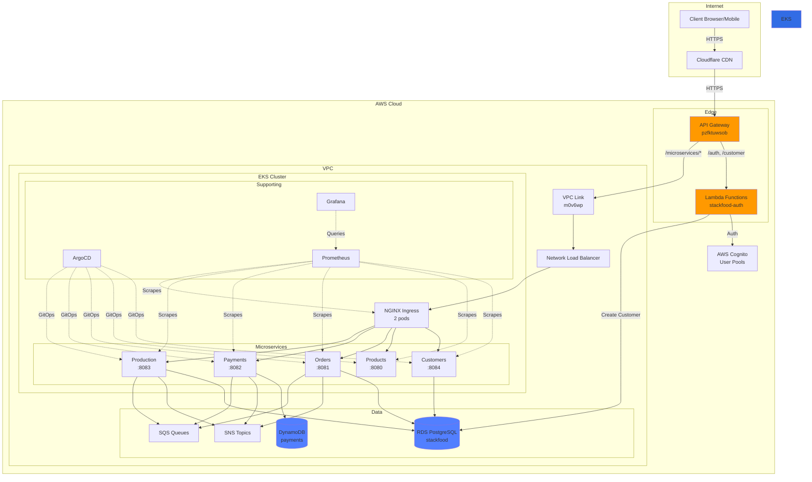
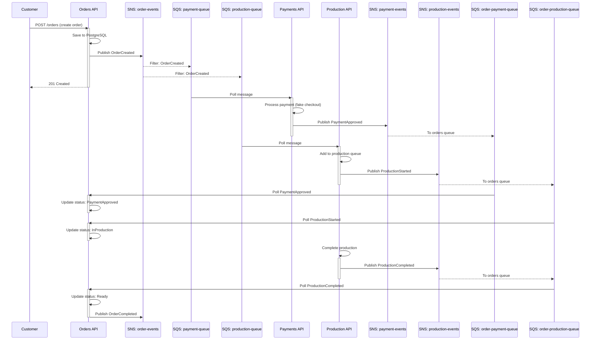

# 🏗️ StackFood - Complete Architecture Documentation

**Event-Driven Microservices Platform on AWS EKS**

> Documentação técnica completa seguindo C4 Model para arquitetura de software, infraestrutura AWS e padrões de comunicação event-driven.

---

## 📋 Table of Contents

1. [C4 Model](#-c4-model-architecture-views)
   - [Level 1: System Context](#level-1-system-context-diagram)
   - [Level 2: Container Diagram](#level-2-container-diagram)
   - [Level 3: Component Diagram](#level-3-component-diagram)
   - [Level 4: Code Diagram](#level-4-code-diagram)
2. [Infrastructure Architecture](#-infrastructure-architecture)
3. [API Gateway Deep Dive](#-api-gateway-deep-dive)
4. [Event-Driven Messaging](#-event-driven-messaging)
5. [Microservices Details](#-microservices-details)
6. [Security & IAM](#-security--iam)
7. [Deployment & GitOps](#-deployment--gitops)
8. [Monitoring & Observability](#-monitoring--observability)
9. [Scalability & Performance](#-scalability--performance)
10. [Diagrams for Tools](#-diagrams-for-tools)

---

## 🎯 C4 Model Architecture Views

### Level 1: System Context Diagram

**High-level view of StackFood ecosystem and external interactions**

```
┌──────────────────────────────────────────────────────────────────────┐
│                           EXTERNAL SYSTEMS                            │
│                                                                        │
│  ┌──────────────┐  ┌──────────────┐  ┌──────────────┐               │
│  │   Customer   │  │  Restaurant  │  │    Admin     │               │
│  │   (Mobile/   │  │   Staff      │  │              │               │
│  │     Web)     │  │   (Tablet)   │  │   (Portal)   │               │
│  └──────┬───────┘  └──────┬───────┘  └──────┬───────┘               │
│         │                  │                  │                        │
└─────────┼──────────────────┼──────────────────┼────────────────────────┘
          │                  │                  │
          │                  │                  │
          ▼                  ▼                  ▼
┌──────────────────────────────────────────────────────────────────────┐
│                          STACKFOOD SYSTEM                             │
│                                                                        │
│  ┌────────────────────────────────────────────────────────────────┐  │
│  │                      AWS Cloud Platform                         │  │
│  │                                                                  │  │
│  │  ┌───────────────┐     ┌──────────────────────────────────┐   │  │
│  │  │  Cloudflare   │────▶│       AWS API Gateway            │   │  │
│  │  │  (CDN + DNS)  │     │   api.stackfood.com.br          │   │  │
│  │  └───────────────┘     └──────────┬───────────────────────┘   │  │
│  │                                    │                            │  │
│  │                        ┌───────────┴───────────┐               │  │
│  │                        │                       │                │  │
│  │                ┌───────▼──────┐       ┌───────▼──────┐        │  │
│  │                │    Lambda    │       │   VPC Link   │        │  │
│  │                │ (Auth/Create)│       │              │        │  │
│  │                └───────┬──────┘       └───────┬──────┘        │  │
│  │                        │                      │                │  │
│  │                ┌───────▼──────┐       ┌──────▼───────┐        │  │
│  │                │   Cognito    │       │  EKS Cluster │        │  │
│  │                │  User Pools  │       │  (K8s 1.34)  │        │  │
│  │                └──────────────┘       └──────┬───────┘        │  │
│  │                                               │                │  │
│  │                          ┌────────────────────┼──────────┐     │  │
│  │                          │                    │          │     │  │
│  │            ┌─────────────▼────┐  ┌───────────▼─────┐  ┌─▼──┐ │  │
│  │            │  Microservices   │  │  SNS/SQS        │  │RDS │ │  │
│  │            │  (5 services)    │  │  (Messaging)    │  │ +  │ │  │
│  │            │                  │  │                 │  │DDB │ │  │
│  │            └──────────────────┘  └─────────────────┘  └────┘ │  │
│  │                                                                  │  │
│  └──────────────────────────────────────────────────────────────┘  │
│                                                                        │
└──────────────────────────────────────────────────────────────────────┘
          │                  │                  │
          │                  │                  │
          ▼                  ▼                  ▼
┌──────────────────────────────────────────────────────────────────────┐
│                        SUPPORTING SYSTEMS                             │
│                                                                        │
│  ┌──────────────┐  ┌──────────────┐  ┌──────────────┐               │
│  │  Mercado Pago │  │   ArgoCD     │  │  Grafana     │               │
│  │  (Payments)   │  │  (GitOps)    │  │(Monitoring)  │               │
│  └───────────────┘  └──────────────┘  └──────────────┘               │
└──────────────────────────────────────────────────────────────────────┘
```

**External Actors:**
- **Customers**: Mobile/Web app users placing orders
- **Restaurant Staff**: Kitchen staff viewing production queue
- **Admin**: Back-office users managing products, orders, and customers

**External Systems:**
- **Mercado Pago**: Payment gateway integration (fake checkout in MVP)
- **ArgoCD**: GitOps continuous deployment
- **Grafana**: Metrics visualization and alerting
- **Cloudflare**: CDN, DNS, and DDoS protection

---

### Level 2: Container Diagram

**Containers (applications and data stores) that make up StackFood**

```
┌─────────────────────────────────────────────────────────────────────────────┐
│                              AWS CLOUD (us-east-1)                           │
│                                                                               │
│  ┌──────────────────────────────────────────────────────────────────────┐   │
│  │                           EDGE LAYER                                  │   │
│  │                                                                        │   │
│  │  ┌─────────────────┐         ┌────────────────────────────────────┐ │   │
│  │  │  Cloudflare CDN │────────▶│     AWS API Gateway (Regional)     │ │   │
│  │  │  DNS: stackfood │         │  api.stackfood.com.br              │ │   │
│  │  │      .com.br    │         │  ID: pzfktuwsob                    │ │   │
│  │  └─────────────────┘         │  Stage: v1                         │ │   │
│  │                               │  Type: REST API                    │ │   │
│  │                               └──────────┬─────────────────────────┘ │   │
│  │                                          │                            │   │
│  └──────────────────────────────────────────┼────────────────────────────┘   │
│                                              │                                │
│                              ┌───────────────┴───────────────┐               │
│                              │                               │                │
│  ┌───────────────────────────┼───────────────────────────────┼──────────────┐│
│  │         SERVERLESS        │                               │  CONTAINER   ││
│  │                           │                               │  PLATFORM    ││
│  │  ┌────────────────────────▼──────┐             ┌─────────▼──────────┐   ││
│  │  │   Lambda Functions            │             │    VPC Link        │   ││
│  │  │   Runtime: .NET 8             │             │    ID: m0v6wp      │   ││
│  │  │                               │             │  Status: AVAILABLE │   ││
│  │  │   stackfood-auth:             │             └─────────┬──────────┘   ││
│  │  │   - POST /auth                │                       │              ││
│  │  │   - POST /customer            │             ┌─────────▼──────────┐   ││
│  │  │                               │             │  Network Load      │   ││
│  │  │   Memory: 256MB               │             │  Balancer (NLB)    │   ││
│  │  │   Timeout: 30s                │             │  Scheme: internet- │   ││
│  │  │   VPC: Enabled                │             │  facing            │   ││
│  │  └────────────┬──────────────────┘             │  Type: network     │   ││
│  │               │                                │  Subnets: 3 public │   ││
│  │               │                                └─────────┬──────────┘   ││
│  │               │                                          │              ││
│  │  ┌────────────▼──────────────────┐             ┌────────▼──────────┐   ││
│  │  │   AWS Cognito User Pools      │             │  NGINX Ingress    │   ││
│  │  │                               │             │  Controller       │   ││
│  │  │   1. stackfood-app-pool       │             │  Replicas: 2      │   ││
│  │  │      (Customers + Staff)      │             │  Version: 4.10.0  │   ││
│  │  │   2. stackfood-argocd-pool    │             │  Class: nginx     │   ││
│  │  │      (GitOps access)          │             └─────────┬──────────┘   ││
│  │  │                               │                       │              ││
│  │  │   Auth: CPF-based (custom)    │                       │              ││
│  │  │   MFA: Disabled               │                       │              ││
│  │  │   Token TTL: 60min            │                       │              ││
│  │  └───────────────────────────────┘                       │              ││
│  │                                                           │              ││
│  └───────────────────────────────────────────────────────────┼──────────────┘│
│                                                               │               │
│  ┌───────────────────────────────────────────────────────────┼──────────────┐│
│  │                  EKS CLUSTER (stackfood-eks)              │              ││
│  │                  Kubernetes: 1.34                         │              ││
│  │                  Nodes: 2x t3.large                       │              ││
│  │                                                           │              ││
│  │  ┌────────────────────────────────────────────────────────▼───────────┐ ││
│  │  │                      MICROSERVICES LAYER                           │ ││
│  │  │                                                                     │ ││
│  │  │  ┌──────────────┐  ┌──────────────┐  ┌──────────────┐            │ ││
│  │  │  │  Customers   │  │   Products   │  │    Orders    │            │ ││
│  │  │  │  Namespace:  │  │  Namespace:  │  │  Namespace:  │            │ ││
│  │  │  │  customers   │  │  products    │  │   orders     │            │ ││
│  │  │  │              │  │              │  │              │            │ ││
│  │  │  │  Port: 8084  │  │  Port: 8080  │  │  Port: 8081  │            │ ││
│  │  │  │  Replicas: 2 │  │  Replicas: 2 │  │  Replicas: 2 │            │ ││
│  │  │  │  DB: RDS PG  │  │  DB: RDS PG  │  │  DB: RDS PG  │            │ ││
│  │  │  │  + Cognito   │  │              │  │              │            │ ││
│  │  │  └──────┬───────┘  └──────┬───────┘  └──────┬───────┘            │ ││
│  │  │         │                  │                  │                    │ ││
│  │  │  ┌──────▼──────────┐  ┌───▼──────────┐  ┌───▼──────────┐        │ ││
│  │  │  │   Payments      │  │  Production  │  │   ArgoCD     │        │ ││
│  │  │  │   Namespace:    │  │  Namespace:  │  │  Namespace:  │        │ ││
│  │  │  │   payments      │  │  production  │  │   argocd     │        │ ││
│  │  │  │                 │  │              │  │              │        │ ││
│  │  │  │   Port: 8082    │  │  Port: 8083  │  │  Port: 443   │        │ ││
│  │  │  │   Replicas: 2   │  │  Replicas: 2 │  │  Replicas: 1 │        │ ││
│  │  │  │   DB: DynamoDB  │  │  DB: RDS PG  │  │  Auth:       │        │ ││
│  │  │  │                 │  │  (JSONB)     │  │  Cognito     │        │ ││
│  │  │  └─────────────────┘  └──────────────┘  └──────────────┘        │ ││
│  │  │                                                                     │ ││
│  │  └─────────────────────────────────────────────────────────────────┘ ││
│  │                                                                         ││
│  │  ┌─────────────────────────────────────────────────────────────────┐  ││
│  │  │                    SUPPORTING SERVICES                           │  ││
│  │  │                                                                   │  ││
│  │  │  ┌────────────────┐  ┌────────────────┐  ┌────────────────┐    │  ││
│  │  │  │  Prometheus    │  │    Grafana     │  │  Node Exporter │    │  ││
│  │  │  │  (Metrics)     │  │  (Dashboard)   │  │  (Monitoring)  │    │  ││
│  │  │  │  Namespace:    │  │  Namespace:    │  │  Namespace:    │    │  ││
│  │  │  │  monitoring    │  │  monitoring    │  │  prometheus-   │    │  ││
│  │  │  │                │  │                │  │  node-exporter │    │  ││
│  │  │  └────────────────┘  └────────────────┘  └────────────────┘    │  ││
│  │  │                                                                   │  ││
│  │  └─────────────────────────────────────────────────────────────────┘  ││
│  │                                                                         ││
│  └─────────────────────────────────────────────────────────────────────────┘│
│                                                                               │
│  ┌───────────────────────────────────────────────────────────────────────┐  │
│  │                        DATA STORES                                     │  │
│  │                                                                         │  │
│  │  ┌────────────────┐  ┌────────────────┐  ┌─────────────────────────┐ │  │
│  │  │  RDS PostgreSQL│  │   DynamoDB     │  │   SNS Topics + SQS      │ │  │
│  │  │  Version: 16.10│  │                │  │   Queues                │ │  │
│  │  │  Instance:     │  │  Tables:       │  │                         │ │  │
│  │  │  db.t3.micro   │  │  - payments    │  │  Topics:                │ │  │
│  │  │  Multi-AZ: No  │  │  - orders      │  │  - order-events         │ │  │
│  │  │  Public: Yes   │  │  - products    │  │  - payment-events       │ │  │
│  │  │  Storage: 20GB │  │                │  │  - production-events    │ │  │
│  │  │                │  │  Billing:      │  │  - customer-events      │ │  │
│  │  │  Databases:    │  │  Pay-per-req   │  │                         │ │  │
│  │  │  - stackfood   │  │  Encryption:   │  │  Queues: 8 main + 8 DLQ │ │  │
│  │  │    (shared)    │  │  Enabled       │  │  Retention: 14 days     │ │  │
│  │  │                │  │                │  │  Long polling: 10s      │ │  │
│  │  └────────────────┘  └────────────────┘  └─────────────────────────┘ │  │
│  │                                                                         │  │
│  └─────────────────────────────────────────────────────────────────────────┘│
│                                                                               │
└───────────────────────────────────────────────────────────────────────────────┘
```

**Container Descriptions:**

1. **Cloudflare CDN**: Edge caching, DDoS protection, DNS management
2. **API Gateway**: HTTP routing, authentication delegation, rate limiting
3. **Lambda Functions**: Serverless auth and customer creation
4. **VPC Link**: Private connectivity between API Gateway and VPC
5. **NLB**: Layer 4 load balancing for NGINX Ingress
6. **NGINX Ingress**: Layer 7 routing within Kubernetes
7. **Microservices**: Business logic containers (.NET 8)
8. **Cognito**: Identity provider and user management
9. **RDS PostgreSQL**: Relational data storage
10. **DynamoDB**: NoSQL for payments and flexible schemas
11. **SNS/SQS**: Asynchronous event-driven messaging
12. **ArgoCD**: GitOps deployment automation
13. **Prometheus/Grafana**: Metrics collection and visualization

---

### Level 3: Component Diagram

**Components inside Customers Microservice (example)**

```
┌────────────────────────────────────────────────────────────────────┐
│              Customers Microservice (Port 8084)                    │
│              Namespace: customers                                   │
│                                                                      │
│  ┌──────────────────────────────────────────────────────────────┐  │
│  │                      API Layer                                │  │
│  │                                                                │  │
│  │  ┌─────────────────────────────────────────────────────────┐ │  │
│  │  │          CustomersController                             │ │  │
│  │  │                                                           │ │  │
│  │  │  GET    /api/customers                                   │ │  │
│  │  │  GET    /api/customers/{id}                              │ │  │
│  │  │  POST   /api/customers                                   │ │  │
│  │  │  PUT    /api/customers/{id}                              │ │  │
│  │  │  DELETE /api/customers/{id}                              │ │  │
│  │  │  POST   /api/customers/auth                              │ │  │
│  │  │                                                           │ │  │
│  │  └────────────────────────┬──────────────────────────────────┘ │  │
│  │                           │                                    │  │
│  └───────────────────────────┼────────────────────────────────────┘  │
│                              │                                        │
│  ┌───────────────────────────▼────────────────────────────────────┐  │
│  │                   Application Layer                            │  │
│  │                                                                 │  │
│  │  ┌────────────────────────────────────────────────────────┐   │  │
│  │  │           Customer Use Cases                            │   │  │
│  │  │                                                          │   │  │
│  │  │  CreateCustomerUseCase                                  │   │  │
│  │  │  - Validate CPF                                         │   │  │
│  │  │  - Create in PostgreSQL                                 │   │  │
│  │  │  - Create in Cognito                                    │   │  │
│  │  │  - Publish CustomerCreated event                        │   │  │
│  │  │                                                          │   │  │
│  │  │  AuthenticateCustomerUseCase                            │   │  │
│  │  │  - Validate CPF                                         │   │  │
│  │  │  - Call Cognito InitiateAuth                            │   │  │
│  │  │  - Return JWT tokens                                    │   │  │
│  │  │                                                          │   │  │
│  │  │  GetCustomerUseCase                                     │   │  │
│  │  │  UpdateCustomerUseCase                                  │   │  │
│  │  │  DeleteCustomerUseCase                                  │   │  │
│  │  │                                                          │   │  │
│  │  └────────────────────────┬───────────────────────────────┘   │  │
│  │                           │                                    │  │
│  └───────────────────────────┼────────────────────────────────────┘  │
│                              │                                        │
│  ┌───────────────────────────▼────────────────────────────────────┐  │
│  │                    Domain Layer                                │  │
│  │                                                                 │  │
│  │  ┌──────────────────────────────────────────────────────────┐ │  │
│  │  │              Customer Entity                              │ │  │
│  │  │                                                            │ │  │
│  │  │  Properties:                                              │ │  │
│  │  │  - Id (Guid)                                              │ │  │
│  │  │  - Name (string)                                          │ │  │
│  │  │  - Email (Email value object)                             │ │  │
│  │  │  - CPF (CPF value object)                                 │ │  │
│  │  │  - CognitoId (string, nullable)                           │ │  │
│  │  │  - CreatedAt (DateTime)                                   │ │  │
│  │  │  - UpdatedAt (DateTime)                                   │ │  │
│  │  │                                                            │ │  │
│  │  │  Methods:                                                 │ │  │
│  │  │  - Validate()                                             │ │  │
│  │  │  - UpdateEmail(Email)                                     │ │  │
│  │  │  - LinkCognito(string)                                    │ │  │
│  │  │                                                            │ │  │
│  │  └──────────────────────────────────────────────────────────┘ │  │
│  │                                                                 │  │
│  │  ┌──────────────────────────────────────────────────────────┐ │  │
│  │  │              Value Objects                                │ │  │
│  │  │                                                            │ │  │
│  │  │  CPF - Validates Brazilian CPF format and checksum       │ │  │
│  │  │  Email - Validates email format                           │ │  │
│  │  │                                                            │ │  │
│  │  └──────────────────────────────────────────────────────────┘ │  │
│  │                                                                 │  │
│  │  ┌──────────────────────────────────────────────────────────┐ │  │
│  │  │              Domain Events                                │ │  │
│  │  │                                                            │ │  │
│  │  │  CustomerCreated                                          │ │  │
│  │  │  CustomerUpdated                                          │ │  │
│  │  │  CustomerDeleted                                          │ │  │
│  │  │                                                            │ │  │
│  │  └──────────────────────────────────────────────────────────┘ │  │
│  │                                                                 │  │
│  └─────────────────────────────────────────────────────────────────┘│
│                                                                      │
│  ┌─────────────────────────────────────────────────────────────────┐│
│  │                 Infrastructure Layer                            ││
│  │                                                                  ││
│  │  ┌──────────────────┐  ┌──────────────────┐  ┌──────────────┐ ││
│  │  │CustomerRepository│  │ CognitoService   │  │ EventPublisher│││
│  │  │                  │  │                  │  │              │ ││
│  │  │  ICustomer       │  │  ICognito        │  │  IEvent      │ ││
│  │  │  Repository      │  │  Service         │  │  Publisher   │ ││
│  │  │                  │  │                  │  │              │ ││
│  │  │  PostgreSQL      │  │  AWS SDK         │  │  SNS Client  │ ││
│  │  │  EF Core         │  │  Cognito API     │  │  Topic: ...  │ ││
│  │  │                  │  │                  │  │              │ ││
│  │  └──────────────────┘  └──────────────────┘  └──────────────┘ ││
│  │                                                                  ││
│  └──────────────────────────────────────────────────────────────────┘│
│                                                                      │
│  ┌─────────────────────────────────────────────────────────────────┐│
│  │                  Cross-Cutting Concerns                         ││
│  │                                                                  ││
│  │  ┌──────────┐  ┌──────────┐  ┌──────────┐  ┌──────────┐       ││
│  │  │  Logging │  │  Health  │  │ Metrics  │  │  Tracing │       ││
│  │  │ (Serilog)│  │  Checks  │  │(Prometheus│  │ (OpenTel)│       ││
│  │  └──────────┘  └──────────┘  └──────────┘  └──────────┘       ││
│  │                                                                  ││
│  └──────────────────────────────────────────────────────────────────┘│
│                                                                      │
└──────────────────────────────────────────────────────────────────────┘
```

**Component Responsibilities:**

- **Controllers**: HTTP request handling, validation, response formatting
- **Use Cases**: Business logic orchestration, transaction boundaries
- **Entities**: Core business objects with invariants
- **Value Objects**: Immutable domain concepts
- **Repositories**: Data persistence abstraction
- **External Services**: Third-party integrations (Cognito, SNS)
- **Events**: Domain event publishing for async communication

---

### Level 4: Code Diagram

**Class structure for Customer Entity (simplified)**

```csharp
// Domain/Entities/Customer.cs
public class Customer : Entity
{
    public Guid Id { get; private set; }
    public string Name { get; private set; }
    public Email Email { get; private set; }
    public CPF CPF { get; private set; }
    public string? CognitoId { get; private set; }
    public DateTime CreatedAt { get; private set; }
    public DateTime UpdatedAt { get; private set; }

    private Customer() { } // EF Core

    public Customer(string name, Email email, CPF cpf)
    {
        Id = Guid.NewGuid();
        Name = name ?? throw new ArgumentNullException(nameof(name));
        Email = email ?? throw new ArgumentNullException(nameof(email));
        CPF = cpf ?? throw new ArgumentNullException(nameof(cpf));
        CreatedAt = DateTime.UtcNow;
        UpdatedAt = DateTime.UtcNow;

        Validate();
    }

    public void UpdateEmail(Email newEmail)
    {
        Email = newEmail ?? throw new ArgumentNullException(nameof(newEmail));
        UpdatedAt = DateTime.UtcNow;
    }

    public void LinkCognito(string cognitoId)
    {
        if (string.IsNullOrWhiteSpace(cognitoId))
            throw new ArgumentException("Cognito ID cannot be empty");

        CognitoId = cognitoId;
        UpdatedAt = DateTime.UtcNow;
    }

    private void Validate()
    {
        if (string.IsNullOrWhiteSpace(Name))
            throw new DomainException("Customer name is required");

        if (Name.Length < 3)
            throw new DomainException("Customer name must be at least 3 characters");
    }
}

// Domain/ValueObjects/CPF.cs
public sealed class CPF : ValueObject
{
    public string Value { get; }

    private CPF(string value)
    {
        Value = value;
    }

    public static CPF Create(string cpf)
    {
        if (string.IsNullOrWhiteSpace(cpf))
            throw new DomainException("CPF cannot be empty");

        var cleaned = new string(cpf.Where(char.IsDigit).ToArray());

        if (cleaned.Length != 11)
            throw new DomainException("CPF must have 11 digits");

        if (!ValidateChecksum(cleaned))
            throw new DomainException("Invalid CPF checksum");

        return new CPF(cleaned);
    }

    private static bool ValidateChecksum(string cpf)
    {
        // CPF validation algorithm
        // ...
        return true;
    }

    protected override IEnumerable<object> GetEqualityComponents()
    {
        yield return Value;
    }
}
```

---

## 🏗️ Infrastructure Architecture

### AWS VPC Network Topology

```
┌─────────────────────────────────────────────────────────────────────┐
│                  VPC: stackfood-vpc (10.0.0.0/16)                   │
│                                                                       │
│  ┌─────────────────────────────────────────────────────────────────┐│
│  │                      Availability Zone A                        ││
│  │                                                                  ││
│  │  ┌──────────────────────┐    ┌──────────────────────┐         ││
│  │  │  Public Subnet       │    │  Private Subnet      │         ││
│  │  │  10.0.101.0/24       │    │  10.0.1.0/24         │         ││
│  │  │                      │    │                      │         ││
│  │  │  - NLB               │    │  - EKS Node 1        │         ││
│  │  │  - NAT Gateway       │    │  - Pods              │         ││
│  │  │                      │    │                      │         ││
│  │  └──────────────────────┘    └──────────────────────┘         ││
│  │                                                                  ││
│  └──────────────────────────────────────────────────────────────────┘│
│                                                                       │
│  ┌─────────────────────────────────────────────────────────────────┐│
│  │                      Availability Zone B                        ││
│  │                                                                  ││
│  │  ┌──────────────────────┐    ┌──────────────────────┐         ││
│  │  │  Public Subnet       │    │  Private Subnet      │         ││
│  │  │  10.0.102.0/24       │    │  10.0.2.0/24         │         ││
│  │  │                      │    │                      │         ││
│  │  │  - NLB               │    │  - EKS Node 2        │         ││
│  │  │  - NAT Gateway       │    │  - Pods              │         ││
│  │  │                      │    │                      │         ││
│  │  └──────────────────────┘    └──────────────────────┘         ││
│  │                                                                  ││
│  └──────────────────────────────────────────────────────────────────┘│
│                                                                       │
│  ┌─────────────────────────────────────────────────────────────────┐│
│  │                      Availability Zone C                        ││
│  │                                                                  ││
│  │  ┌──────────────────────┐    ┌──────────────────────┐         ││
│  │  │  Public Subnet       │    │  Private Subnet      │         ││
│  │  │  10.0.103.0/24       │    │  10.0.3.0/24         │         ││
│  │  │                      │    │                      │         ││
│  │  │  - NLB               │    │  (Reserved)          │         ││
│  │  │  - NAT Gateway       │    │                      │         ││
│  │  │                      │    │                      │         ││
│  │  └──────────────────────┘    └──────────────────────┘         ││
│  │                                                                  ││
│  └──────────────────────────────────────────────────────────────────┘│
│                                                                       │
│  ┌──────────────────────┐                                           │
│  │  Internet Gateway    │                                           │
│  │  stackfood-vpc-igw   │                                           │
│  └──────────────────────┘                                           │
│                                                                       │
└───────────────────────────────────────────────────────────────────────┘
```

### Kubernetes Cluster Architecture

```
┌─────────────────────────────────────────────────────────────────────┐
│                    EKS Cluster: stackfood-eks                       │
│                    Version: 1.34                                     │
│                    Endpoint: Public + Private                       │
│                                                                       │
│  ┌─────────────────────────────────────────────────────────────────┐│
│  │              Control Plane (AWS Managed)                        ││
│  │              Multi-AZ, Auto-scaled by AWS                       ││
│  │                                                                  ││
│  │  - API Server                                                   ││
│  │  - etcd                                                          ││
│  │  - Controller Manager                                           ││
│  │  - Scheduler                                                     ││
│  │  - CloudWatch Logs enabled                                      ││
│  │                                                                  ││
│  └──────────────────────────────────────────────────────────────────┘│
│                              │                                       │
│                              │                                       │
│  ┌───────────────────────────▼──────────────────────────────────────┐│
│  │                      Data Plane (Node Groups)                   ││
│  │                                                                  ││
│  │  ┌────────────────────────────────────────────────────────────┐ ││
│  │  │  Node Group: api                                           │ ││
│  │  │  Instance Type: t3.large (2 vCPU, 8GB RAM)                │ ││
│  │  │  Desired: 1, Min: 1, Max: 3                                │ ││
│  │  │  AMI: EKS Optimized                                        │ ││
│  │  │  Labels: role=api                                          │ ││
│  │  │                                                             │ ││
│  │  │  Node 1 (ip-10-0-101-177.ec2.internal)                     │ ││
│  │  │  - NGINX Ingress Pod 1                                     │ ││
│  │  │  - Customers Pod 1                                         │ ││
│  │  │  - Orders Pod 1                                            │ ││
│  │  │  - Payments Pod 1                                          │ ││
│  │  │                                                             │ ││
│  │  └────────────────────────────────────────────────────────────┘ ││
│  │                                                                  ││
│  │  ┌────────────────────────────────────────────────────────────┐ ││
│  │  │  Node Group: worker                                        │ ││
│  │  │  Instance Type: t3.large (2 vCPU, 8GB RAM)                │ ││
│  │  │  Desired: 1, Min: 1, Max: 3                                │ ││
│  │  │  AMI: EKS Optimized                                        │ ││
│  │  │  Labels: role=worker                                       │ ││
│  │  │                                                             │ ││
│  │  │  Node 2 (ip-10-0-102-132.ec2.internal)                     │ ││
│  │  │  - NGINX Ingress Pod 2                                     │ ││
│  │  │  - Customers Pod 2                                         │ ││
│  │  │  - Orders Pod 2                                            │ ││
│  │  │  - Products Pod 2                                          │ ││
│  │  │  - Payments Pod 2                                          │ ││
│  │  │  - Production Pod 2                                        │ ││
│  │  │  - ArgoCD Pod                                              │ ││
│  │  │  - Prometheus Pod                                          │ ││
│  │  │                                                             │ ││
│  │  └────────────────────────────────────────────────────────────┘ ││
│  │                                                                  ││
│  └──────────────────────────────────────────────────────────────────┘│
│                                                                       │
│  ┌──────────────────────────────────────────────────────────────────┐│
│  │                      Add-ons                                     ││
│  │                                                                   ││
│  │  - VPC-CNI (v1.18)          - Pod networking                    ││
│  │  - CoreDNS (v1.11)          - Service discovery                 ││
│  │  - kube-proxy (v1.34)       - Service routing                   ││
│  │  - EBS CSI Driver           - Persistent volumes                ││
│  │                                                                   ││
│  └───────────────────────────────────────────────────────────────────┘│
│                                                                       │
└───────────────────────────────────────────────────────────────────────┘
```

---

## 🚪 API Gateway Deep Dive

### Complete Request Flow

```
┌──────────────────────────────────────────────────────────────────────┐
│                  REQUEST FLOW: API Gateway → EKS                     │
│                                                                        │
│  1. Client Request                                                    │
│     GET https://api.stackfood.com.br/v1/orders/api/orders            │
│                                                                        │
│                           ↓                                           │
│                                                                        │
│  2. Cloudflare (CDN + DNS)                                           │
│     - DNS resolution: api.stackfood.com.br → API Gateway             │
│     - CDN cache check (MISS for dynamic content)                     │
│     - DDoS protection                                                 │
│     - Forward to API Gateway                                          │
│                                                                        │
│                           ↓                                           │
│                                                                        │
│  3. AWS API Gateway (pzfktuwsob)                                     │
│     Stage: v1                                                         │
│     Resource: /orders/{proxy+}                                       │
│     Method: GET                                                       │
│                                                                        │
│     a) Method Request                                                 │
│        - Authorization: NONE (public)                                │
│        - Request Parameters:                                          │
│          method.request.path.proxy = true                            │
│        - Extracted: proxy = "api/orders"                             │
│                                                                        │
│     b) Integration Request                                            │
│        - Type: HTTP_PROXY                                            │
│        - Integration HTTP Method: GET                                │
│        - Connection: VPC_LINK (m0v6wp)                               │
│        - URI: http://NLB_DNS/orders/{proxy}                          │
│        - Request Parameters:                                          │
│          integration.request.path.proxy = method.request.path.proxy  │
│        - Final URI: http://NLB_DNS/orders/api/orders                │
│                                                                        │
│                           ↓                                           │
│                                                                        │
│  4. VPC Link (m0v6wp)                                                │
│     Status: AVAILABLE                                                 │
│     Target: NLB ARN                                                   │
│     - Establish private connection to VPC                            │
│     - Forward request to NLB                                          │
│                                                                        │
│                           ↓                                           │
│                                                                        │
│  5. Network Load Balancer                                             │
│     DNS: a15b3257851d441cab158f71eb788597-...elb.us-east-1.aws...   │
│     Type: network (Layer 4)                                          │
│     Scheme: internet-facing                                           │
│     Subnets: 3 public (multi-AZ)                                     │
│                                                                        │
│     - Receive: http://NLB_DNS/orders/api/orders                      │
│     - Listener: Port 80 → Target Group (NGINX Ingress)              │
│     - Health Check: HTTP:80/ (NGINX default backend)                │
│     - Load balance to: 10.0.101.177:31670 or 10.0.102.132:31670     │
│                                                                        │
│                           ↓                                           │
│                                                                        │
│  6. NGINX Ingress Controller Pod                                      │
│     Namespace: ingress-nginx                                          │
│     Pod IP: 10.0.101.177 (example)                                   │
│     NodePort: 31670 (mapped to container port 80)                    │
│                                                                        │
│     - Receive: GET /orders/api/orders HTTP/1.1                       │
│     - Match Ingress Rule:                                             │
│       Path: /orders(/|$)(.*)                                         │
│       Regex: true                                                     │
│       Backend: stackfood-orders.orders.svc.cluster.local:8081       │
│     - Rewrite: /$2                                                    │
│       /orders/api/orders → /api/orders                               │
│     - Forward to Service                                              │
│                                                                        │
│                           ↓                                           │
│                                                                        │
│  7. Kubernetes Service (stackfood-orders)                            │
│     Namespace: orders                                                 │
│     Type: ClusterIP                                                   │
│     Cluster IP: 172.20.50.82                                         │
│     Port: 8081                                                        │
│     Selector: app=stackfood-orders                                   │
│                                                                        │
│     - Load balance to Pod IPs:                                        │
│       10.0.102.139:8081 or 10.0.102.237:8081                        │
│                                                                        │
│                           ↓                                           │
│                                                                        │
│  8. Orders Pod                                                         │
│     Namespace: orders                                                 │
│     Pod IP: 10.0.102.139 (example)                                   │
│     Container Port: 8081                                              │
│     Image: stackfood-orders:latest                                    │
│                                                                        │
│     - Receive: GET /api/orders HTTP/1.1                              │
│     - Execute: OrdersController.GetOrders()                          │
│     - Query: PostgreSQL RDS                                           │
│     - Return: List<Order> as JSON                                    │
│                                                                        │
│                           ↓                                           │
│                                                                        │
│  9. Response Path (reverse flow)                                      │
│     Pod → Service → NGINX → NLB → VPC Link → API GW → CF → Client   │
│                                                                        │
│     Final Response:                                                   │
│     HTTP/1.1 200 OK                                                  │
│     Content-Type: application/json                                    │
│                                                                        │
│     [                                                                 │
│       {                                                                │
│         "orderId": "uuid",                                            │
│         "customerId": "uuid",                                         │
│         "status": "Pending",                                          │
│         "items": [...]                                                 │
│       }                                                                │
│     ]                                                                 │
│                                                                        │
└──────────────────────────────────────────────────────────────────────┘
```

### API Gateway Route Matrix

| Route | Method | Type | Target | Auth |
|-------|--------|------|--------|------|
| `/auth` | POST | AWS_PROXY | Lambda: stackfood-auth | None |
| `/customer` | POST | AWS_PROXY | Lambda: stackfood-auth | None |
| `/customers/{proxy+}` | GET, POST, PUT, DELETE, PATCH, HEAD, OPTIONS | HTTP_PROXY | VPC Link → NLB → stackfood-customers:8084 | None |
| `/products/{proxy+}` | GET, POST, PUT, DELETE, PATCH, HEAD, OPTIONS | HTTP_PROXY | VPC Link → NLB → stackfood-products:8080 | None |
| `/orders/{proxy+}` | GET, POST, PUT, DELETE, PATCH, HEAD, OPTIONS | HTTP_PROXY | VPC Link → NLB → stackfood-orders:8081 | None |
| `/payments/{proxy+}` | GET, POST, PUT, DELETE, PATCH, HEAD, OPTIONS | HTTP_PROXY | VPC Link → NLB → stackfood-payments:8082 | None |
| `/production/{proxy+}` | GET, POST, PUT, DELETE, PATCH, HEAD, OPTIONS | HTTP_PROXY | VPC Link → NLB → stackfood-production:8083 | None |

**Total Routes:** 2 Lambda + 35 HTTP_PROXY (5 microservices × 7 methods)

### NGINX Ingress Configuration

```yaml
# Example: Orders Ingress
apiVersion: networking.k8s.io/v1
kind: Ingress
metadata:
  name: stackfood-orders-ingress
  namespace: orders
  annotations:
    nginx.ingress.kubernetes.io/rewrite-target: /$2
    nginx.ingress.kubernetes.io/use-regex: "true"
    nginx.ingress.kubernetes.io/ssl-redirect: "false"
    nginx.ingress.kubernetes.io/use-forwarded-headers: "true"
    nginx.ingress.kubernetes.io/backend-protocol: "HTTP"
spec:
  ingressClassName: nginx
  rules:
    - http:
        paths:
          - path: /orders(/|$)(.*)
            pathType: ImplementationSpecific
            backend:
              service:
                name: stackfood-orders
                port:
                  number: 8081
```

**Path Rewrite Explanation:**
- Request: `/orders/api/orders`
- Regex match: `/orders(/|$)(.*)`
  - Group 1: `/` or end of string
  - Group 2: `api/orders`
- Rewrite target: `/$2` → `/api/orders`
- Final backend request: `GET /api/orders HTTP/1.1`

---

## 📬 Event-Driven Messaging

### Complete Event Flow Diagram

```
┌────────────────────────────────────────────────────────────────────┐
│                      EVENT-DRIVEN ARCHITECTURE                      │
│                                                                      │
│  1. Order Creation Flow                                             │
│                                                                      │
│     Client                                                          │
│       │                                                              │
│       │ POST /orders/api/orders                                     │
│       ▼                                                              │
│     Orders API                                                       │
│       │                                                              │
│       │ 1. Save to PostgreSQL                                       │
│       │ 2. Publish OrderCreated event                               │
│       │                                                              │
│       ▼                                                              │
│     SNS Topic: stackfood-order-events                               │
│       │                                                              │
│       ├─────────────────────┬────────────────────────────┐         │
│       │                     │                            │          │
│       ▼                     ▼                            ▼          │
│     Filter:               Filter:                     (Future)      │
│     OrderCreated          OrderCreated                              │
│     OrderCancelled        OrderConfirmed                            │
│       │                     │                                        │
│       ▼                     ▼                                        │
│     SQS: stackfood-       SQS: stackfood-                           │
│     payment-events-       production-events-                        │
│     queue                 queue                                      │
│       │                     │                                        │
│       ▼                     ▼                                        │
│     Payments API          Production API                            │
│       │                     │                                        │
│       │                     │                                        │
│  2. Payment Processing     │  3. Production Processing              │
│                             │                                        │
│     Payments API            │                                        │
│       │                     │                                        │
│       │ Process payment     │                                        │
│       │ (Fake checkout)     │                                        │
│       │                     │                                        │
│       │ Publish:            │                                        │
│       │ PaymentApproved     │                                        │
│       ▼                     │                                        │
│     SNS Topic:              │                                        │
│     stackfood-payment-      │                                        │
│     events                  │                                        │
│       │                     │                                        │
│       │ Filter:             │                                        │
│       │ PaymentApproved     │                                        │
│       │ PaymentFailed       │                                        │
│       │ PaymentRefunded     │                                        │
│       │                     │                                        │
│       ▼                     │                                        │
│     SQS: stackfood-         │                                        │
│     order-payment-          │                                        │
│     events-queue            │                                        │
│       │                     │                                        │
│       ▼                     │                                        │
│     Orders API              │                                        │
│       │                     │                                        │
│       │ Update status:      │                                        │
│       │ PaymentApproved     │                                        │
│       │                     │                                        │
│       │                     │  Production API                        │
│       │                     │    │                                   │
│       │                     │    │ Start production                  │
│       │                     │    │                                   │
│       │                     │    │ Publish:                          │
│       │                     │    │ ProductionStarted                 │
│       │                     │    ▼                                   │
│       │                     │  SNS Topic:                            │
│       │                     │  stackfood-production-                 │
│       │                     │  events                                │
│       │                     │    │                                   │
│       │                     │    │ Filter:                           │
│       │                     │    │ ProductionStarted                 │
│       │                     │    │ ProductionCompleted               │
│       │                     │    │ ProductionFailed                  │
│       │                     │    │                                   │
│       │                     │    ▼                                   │
│       │                     │  SQS: stackfood-                       │
│       │                     │  order-production-                     │
│       │                     │  events-queue                          │
│       │                     │    │                                   │
│       │                     │    ▼                                   │
│       │                     │  Orders API                            │
│       │                     │    │                                   │
│       │                     │    │ Update status:                    │
│       │                     │    │ InProduction → Ready              │
│       │                     │    │                                   │
│       ▼                     ▼    ▼                                   │
│                                                                       │
│     All updates persisted in PostgreSQL                             │
│                                                                       │
└───────────────────────────────────────────────────────────────────────┘
```

### Message Structures

#### OrderCreated Event
```json
{
  "MessageId": "uuid",
  "TopicArn": "arn:aws:sns:us-east-1:975050205506:stackfood-order-events",
  "Message": {
    "eventType": "OrderCreated",
    "eventId": "uuid",
    "timestamp": "2025-12-30T01:00:00Z",
    "aggregateId": "9d90b301-535e-4ced-8dd2-19ea44652edf",
    "payload": {
      "orderId": "9d90b301-535e-4ced-8dd2-19ea44652edf",
      "customerId": "123e4567-e89b-12d3-a456-426614174000",
      "items": [
        {
          "productId": "prod-001",
          "productName": "Big Mac",
          "quantity": 2,
          "unitPrice": 15.99,
          "totalPrice": 31.98
        }
      ],
      "subtotal": 31.98,
      "tax": 3.20,
      "total": 35.18,
      "status": "Pending",
      "createdAt": "2025-12-30T01:00:00Z"
    }
  },
  "MessageAttributes": {
    "eventType": {
      "Type": "String",
      "Value": "OrderCreated"
    },
    "aggregateType": {
      "Type": "String",
      "Value": "Order"
    }
  }
}
```

#### PaymentApproved Event
```json
{
  "eventType": "PaymentApproved",
  "eventId": "uuid",
  "timestamp": "2025-12-30T01:01:00Z",
  "aggregateId": "9d90b301-535e-4ced-8dd2-19ea44652edf",
  "payload": {
    "orderId": "9d90b301-535e-4ced-8dd2-19ea44652edf",
    "paymentId": "pay-789",
    "amount": 35.18,
    "paymentMethod": "fake_checkout",
    "transactionId": "txn-123456",
    "approvedAt": "2025-12-30T01:01:00Z",
    "metadata": {
      "customerName": "PAGO",  // Fake checkout indicator
      "provider": "mercadopago_mock"
    }
  }
}
```

### SNS/SQS Configuration Details

**SNS Topic Settings:**
```hcl
resource "aws_sns_topic" "order_events" {
  name                        = "stackfood-order-events"
  display_name                = "StackFood Order Events"
  fifo_topic                  = false
  content_based_deduplication = false

  tags = {
    Service     = "orders"
    MessageType = "events"
  }
}
```

**SQS Queue Settings:**
```hcl
resource "aws_sqs_queue" "payment_events" {
  name                      = "stackfood-payment-events-queue"
  delay_seconds             = 0
  max_message_size          = 262144  # 256 KB
  message_retention_seconds = 1209600 # 14 days
  receive_wait_time_seconds = 10      # Long polling
  visibility_timeout_seconds = 300    # 5 minutes

  # Dead Letter Queue
  redrive_policy = jsonencode({
    deadLetterTargetArn = aws_sqs_queue.payment_events_dlq.arn
    maxReceiveCount     = 3
  })

  # Encryption
  sqs_managed_sse_enabled = true

  tags = {
    Service     = "payments"
    SourceTopic = "stackfood-order-events"
  }
}
```

**SNS Subscription with Filter Policy:**
```hcl
resource "aws_sns_topic_subscription" "order_to_payments" {
  topic_arn = aws_sns_topic.order_events.arn
  protocol  = "sqs"
  endpoint  = aws_sqs_queue.payment_events.arn

  # Only receive OrderCreated and OrderCancelled events
  filter_policy = jsonencode({
    eventType = ["OrderCreated", "OrderCancelled"]
  })

  raw_message_delivery = false
}
```

---

## 🔐 Security & IAM

### IAM Roles and Policies

**EKS Service Account for Microservices:**

```yaml
# ServiceAccount with IRSA (IAM Roles for Service Accounts)
apiVersion: v1
kind: ServiceAccount
metadata:
  name: stackfood-orders-sa
  namespace: orders
  annotations:
    eks.amazonaws.com/role-arn: arn:aws:iam::975050205506:role/LabRole
```

**IAM Policy for Orders Service:**

```json
{
  "Version": "2012-10-17",
  "Statement": [
    {
      "Sid": "SNSPublish",
      "Effect": "Allow",
      "Action": [
        "sns:Publish"
      ],
      "Resource": [
        "arn:aws:sns:us-east-1:975050205506:stackfood-order-events",
        "arn:aws:sns:us-east-1:975050205506:stackfood-customer-events"
      ]
    },
    {
      "Sid": "SQSConsume",
      "Effect": "Allow",
      "Action": [
        "sqs:ReceiveMessage",
        "sqs:DeleteMessage",
        "sqs:GetQueueAttributes",
        "sqs:ChangeMessageVisibility"
      ],
      "Resource": [
        "arn:aws:sqs:us-east-1:975050205506:stackfood-order-payment-events-queue",
        "arn:aws:sqs:us-east-1:975050205506:stackfood-order-production-events-queue"
      ]
    },
    {
      "Sid": "RDSConnect",
      "Effect": "Allow",
      "Action": [
        "rds-db:connect"
      ],
      "Resource": [
        "arn:aws:rds-db:us-east-1:975050205506:dbuser:*/stackfood"
      ]
    }
  ]
}
```

### Network Security

**Security Groups:**

```hcl
# EKS Node Security Group
resource "aws_security_group" "eks_nodes" {
  name        = "stackfood-eks-nodes-sg"
  description = "Security group for EKS worker nodes"
  vpc_id      = var.vpc_id

  # Inbound from NLB
  ingress {
    from_port   = 30000
    to_port     = 32767
    protocol    = "tcp"
    cidr_blocks = ["10.0.0.0/16"]  # VPC CIDR
    description = "NodePort range for NLB"
  }

  # Inbound from Control Plane
  ingress {
    from_port       = 443
    to_port         = 443
    protocol        = "tcp"
    security_groups = [aws_security_group.eks_cluster.id]
    description     = "Kubernetes API from control plane"
  }

  # Outbound to internet (for pulling images, AWS APIs)
  egress {
    from_port   = 0
    to_port     = 0
    protocol    = "-1"
    cidr_blocks = ["0.0.0.0/0"]
  }
}

# RDS Security Group
resource "aws_security_group" "rds" {
  name        = "stackfood-rds-sg"
  description = "Security group for RDS PostgreSQL"
  vpc_id      = var.vpc_id

  # Inbound from EKS nodes
  ingress {
    from_port       = 5432
    to_port         = 5432
    protocol        = "tcp"
    security_groups = [aws_security_group.eks_nodes.id]
    description     = "PostgreSQL from EKS"
  }

  # Inbound from Lambda (if in VPC)
  ingress {
    from_port       = 5432
    to_port         = 5432
    protocol        = "tcp"
    security_groups = [aws_security_group.lambda.id]
    description     = "PostgreSQL from Lambda"
  }
}
```

### Secrets Management

**AWS Secrets Manager:**

```bash
# Database connection strings stored in Secrets Manager
stackfood/prod/postgresql/connection-string
stackfood/prod/cognito/client-secret
stackfood/prod/mercadopago/access-token
```

**Kubernetes Secrets (from AWS Secrets Manager):**

```yaml
# Using External Secrets Operator (optional)
apiVersion: external-secrets.io/v1beta1
kind: ExternalSecret
metadata:
  name: stackfood-db-secret
  namespace: orders
spec:
  secretStoreRef:
    name: aws-secrets-manager
    kind: SecretStore
  target:
    name: db-credentials
  data:
    - secretKey: connection-string
      remoteRef:
        key: stackfood/prod/postgresql/connection-string
```

---

## 🚀 Deployment & GitOps

### ArgoCD Architecture

```
┌────────────────────────────────────────────────────────────────────┐
│                         GIT REPOSITORY                             │
│         https://github.com/Stack-Food/stackfood-infra              │
│                                                                      │
│  apps/                                                              │
│  ├── customers/                                                     │
│  │   ├── base/                                                      │
│  │   │   ├── deployment.yaml                                       │
│  │   │   ├── service.yaml                                          │
│  │   │   ├── ingress.yaml                                          │
│  │   │   └── kustomization.yaml                                    │
│  │   └── prod/                                                      │
│  │       ├── kustomization.yaml                                    │
│  │       └── namespace.yaml                                        │
│  ├── orders/...                                                     │
│  ├── products/...                                                   │
│  ├── payments/...                                                   │
│  └── production/...                                                 │
│                                                                      │
└───────────────────────┬────────────────────────────────────────────┘
                        │
                        │ Git Pull (every 3 minutes)
                        │
                        ▼
┌────────────────────────────────────────────────────────────────────┐
│                         ARGOCD SERVER                              │
│                   Namespace: argocd                                 │
│                   URL: https://argo.stackfood.com.br               │
│                                                                      │
│  ┌──────────────────────────────────────────────────────────────┐  │
│  │                   ArgoCD Applications                         │  │
│  │                                                                │  │
│  │  - stackfood-customers-prod                                   │  │
│  │    Source: apps/customers/prod                                │  │
│  │    Destination: customers namespace                           │  │
│  │    Sync: Automated                                            │  │
│  │    Prune: Enabled                                             │  │
│  │    Self-Heal: Enabled                                         │  │
│  │                                                                │  │
│  │  - stackfood-orders-prod                                      │  │
│  │  - stackfood-products-prod                                    │  │
│  │  - stackfood-payments-prod                                    │  │
│  │  - stackfood-production-prod                                  │  │
│  │                                                                │  │
│  └──────────────────────────────────────────────────────────────┘  │
│                                                                      │
│                           │                                         │
│                           │ kubectl apply                           │
│                           ▼                                         │
│                                                                      │
│  ┌──────────────────────────────────────────────────────────────┐  │
│  │                   EKS CLUSTER                                 │  │
│  │                                                                │  │
│  │  Automatic deployment when:                                   │  │
│  │  1. Git repository changes                                    │  │
│  │  2. Cluster state drifts from desired state                   │  │
│  │  3. Manual sync triggered                                     │  │
│  │                                                                │  │
│  │  Rollback on failure:                                         │  │
│  │  - Automatic if health check fails                            │  │
│  │  - Manual rollback via ArgoCD UI                              │  │
│  │                                                                │  │
│  └──────────────────────────────────────────────────────────────┘  │
│                                                                      │
└──────────────────────────────────────────────────────────────────────┘
```

### CI/CD Pipeline

```
┌────────────────────────────────────────────────────────────────────┐
│                    CONTINUOUS INTEGRATION                          │
│                                                                      │
│  Developer                                                          │
│     │                                                                │
│     │ git push                                                      │
│     ▼                                                                │
│  GitHub Repository                                                  │
│     │                                                                │
│     │ trigger                                                       │
│     ▼                                                                │
│  GitHub Actions                                                     │
│     │                                                                │
│     ├─ Build .NET 8 application                                    │
│     ├─ Run unit tests                                              │
│     ├─ Run integration tests                                       │
│     ├─ SonarCloud code analysis                                    │
│     ├─ Build Docker image                                          │
│     ├─ Tag: <service>:<git-sha>                                    │
│     ├─ Push to Amazon ECR                                          │
│     │                                                                │
│     └─ Update Kustomize image tag in stackfood-infra repo         │
│                                                                      │
└───────────────────────┬────────────────────────────────────────────┘
                        │
                        │ Git push to infra repo
                        │
                        ▼
┌────────────────────────────────────────────────────────────────────┐
│                  CONTINUOUS DEPLOYMENT (GitOps)                    │
│                                                                      │
│  stackfood-infra Repository                                        │
│     │                                                                │
│     │ detected by ArgoCD (polling or webhook)                      │
│     ▼                                                                │
│  ArgoCD                                                             │
│     │                                                                │
│     ├─ Compare desired state (Git) vs actual state (K8s)           │
│     ├─ Detect drift                                                │
│     ├─ Apply changes to cluster                                    │
│     ├─ Wait for pods to be ready                                   │
│     ├─ Run health checks                                           │
│     │                                                                │
│     ├─ ✅ Success → Application synced                             │
│     └─ ❌ Failure → Automatic rollback                             │
│                                                                      │
└──────────────────────────────────────────────────────────────────────┘
```

### Deployment Strategy

**Rolling Update (default):**

```yaml
apiVersion: apps/v1
kind: Deployment
spec:
  replicas: 2
  strategy:
    type: RollingUpdate
    rollingUpdate:
      maxSurge: 1        # Max 1 extra pod during update
      maxUnavailable: 0  # Never go below 2 pods
```

**Update Flow:**
1. Create new pod with new image
2. Wait for new pod to be Ready
3. Terminate one old pod
4. Repeat until all pods updated

---

## 📊 Monitoring & Observability

### Monitoring Stack

```
┌────────────────────────────────────────────────────────────────────┐
│                     MONITORING ARCHITECTURE                        │
│                                                                      │
│  ┌──────────────────────────────────────────────────────────────┐  │
│  │                   METRICS COLLECTION                          │  │
│  │                                                                │  │
│  │  ┌────────────────┐       ┌────────────────┐                 │  │
│  │  │  Prometheus    │◄──────┤ Node Exporter  │                 │  │
│  │  │  Server        │       │ (each node)    │                 │  │
│  │  │                │       └────────────────┘                 │  │
│  │  │  Namespace:    │                                          │  │
│  │  │  monitoring    │       ┌────────────────┐                 │  │
│  │  │                │◄──────┤ kube-state-    │                 │  │
│  │  │  Storage:      │       │ metrics        │                 │  │
│  │  │  15d retention │       └────────────────┘                 │  │
│  │  │                │                                          │  │
│  │  │  Scrape:       │       ┌────────────────┐                 │  │
│  │  │  - /metrics    │◄──────┤ Microservices  │                 │  │
│  │  │  - /health     │       │ (Prometheus    │                 │  │
│  │  │  Every 15s     │       │  middleware)   │                 │  │
│  │  │                │       └────────────────┘                 │  │
│  │  │                │                                          │  │
│  │  │                │       ┌────────────────┐                 │  │
│  │  │                │◄──────┤ NGINX Ingress  │                 │  │
│  │  │                │       │ /metrics       │                 │  │
│  │  └────────┬───────┘       └────────────────┘                 │  │
│  │           │                                                   │  │
│  └───────────┼───────────────────────────────────────────────────┘  │
│              │                                                      │
│              │ PromQL queries                                      │
│              ▼                                                      │
│  ┌──────────────────────────────────────────────────────────────┐  │
│  │                   VISUALIZATION                               │  │
│  │                                                                │  │
│  │  ┌────────────────────────────────────────────────────────┐  │  │
│  │  │                   Grafana                               │  │  │
│  │  │            https://grafana.stackfood.com.br            │  │  │
│  │  │                                                          │  │  │
│  │  │  Dashboards:                                            │  │  │
│  │  │  - Kubernetes Cluster Overview                          │  │  │
│  │  │  - Microservices Performance                            │  │  │
│  │  │  - API Gateway Metrics                                  │  │  │
│  │  │  - SNS/SQS Queue Metrics                                │  │  │
│  │  │  - Database Performance                                 │  │  │
│  │  │  - NGINX Ingress Metrics                                │  │  │
│  │  │                                                          │  │  │
│  │  │  Alerts:                                                 │  │  │
│  │  │  - High error rate (5xx > 5%)                           │  │  │
│  │  │  - Pod CPU > 80%                                        │  │  │
│  │  │  - Pod Memory > 90%                                     │  │  │
│  │  │  - Queue depth > 1000 messages                          │  │  │
│  │  │  - API latency p99 > 1s                                 │  │  │
│  │  │                                                          │  │  │
│  │  └──────────────────────────────────────────────────────────┘  │  │
│  │                                                                │  │
│  └────────────────────────────────────────────────────────────────┘  │
│                                                                      │
│  ┌──────────────────────────────────────────────────────────────┐  │
│  │                      AWS CLOUDWATCH                           │  │
│  │                                                                │  │
│  │  - API Gateway logs and metrics                              │  │
│  │  - Lambda execution logs                                     │  │
│  │  - EKS control plane logs                                    │  │
│  │  - RDS performance insights                                  │  │
│  │  - SNS/SQS metrics                                           │  │
│  │  - VPC Flow Logs                                             │  │
│  │                                                                │  │
│  └────────────────────────────────────────────────────────────────┘  │
│                                                                      │
└──────────────────────────────────────────────────────────────────────┘
```

### Key Metrics Tracked

**Application Metrics (exposed by microservices):**

```csharp
// ASP.NET Core metrics middleware
app.UseHttpMetrics();  // Prometheus middleware

// Custom business metrics
private static readonly Counter OrdersCreated = Metrics
    .CreateCounter("stackfood_orders_created_total", "Total orders created");

private static readonly Histogram OrderProcessingDuration = Metrics
    .CreateHistogram("stackfood_order_processing_duration_seconds",
        "Order processing duration");

private static readonly Gauge ActiveOrders = Metrics
    .CreateGauge("stackfood_orders_active", "Number of active orders");
```

**Exposed metrics:**
- `http_requests_total` - Total HTTP requests
- `http_request_duration_seconds` - Request latency histogram
- `http_requests_in_progress` - Current requests being processed
- `process_cpu_seconds_total` - CPU usage
- `dotnet_total_memory_bytes` - Memory usage
- `stackfood_orders_created_total` - Custom business metric

**Infrastructure Metrics:**
- Pod CPU/Memory usage
- Node CPU/Memory/Disk usage
- Network I/O
- Container restart count
- Deployment status

**AWS Metrics:**
- API Gateway: Count, Latency, 4XX/5XX errors
- SNS: Messages published, failed deliveries
- SQS: Messages sent/received, queue depth, age of oldest message
- RDS: Connections, CPU, storage, IOPS
- Lambda: Invocations, duration, errors, throttles
- NLB: Active connections, processed bytes, healthy targets

---

## ⚡ Scalability & Performance

### Horizontal Pod Autoscaler (HPA)

```yaml
apiVersion: autoscaling/v2
kind: HorizontalPodAutoscaler
metadata:
  name: stackfood-orders-hpa
  namespace: orders
spec:
  scaleTargetRef:
    apiVersion: apps/v1
    kind: Deployment
    name: stackfood-orders
  minReplicas: 2
  maxReplicas: 10
  metrics:
    - type: Resource
      resource:
        name: cpu
        target:
          type: Utilization
          averageUtilization: 70
    - type: Resource
      resource:
        name: memory
        target:
          type: Utilization
          averageUtilization: 80
  behavior:
    scaleUp:
      stabilizationWindowSeconds: 60
      policies:
        - type: Percent
          value: 50
          periodSeconds: 60
    scaleDown:
      stabilizationWindowSeconds: 300
      policies:
        - type: Pods
          value: 1
          periodSeconds: 60
```

**Scaling Behavior:**
- **Scale Up**: Add 50% more pods every 60s (max)
- **Scale Down**: Remove 1 pod every 60s (max), wait 5min before scaling down
- **Example**: 2 pods → 3 pods → 4 pods → 6 pods → 9 pods → 10 pods (max)

### Resource Limits

```yaml
resources:
  requests:
    cpu: 100m      # 0.1 CPU core guaranteed
    memory: 256Mi  # 256 MB guaranteed
  limits:
    cpu: 500m      # Max 0.5 CPU core
    memory: 512Mi  # Max 512 MB
```

**Quality of Service Classes:**
- **Guaranteed**: requests == limits → Highest priority
- **Burstable**: requests < limits → Medium priority (used by StackFood)
- **BestEffort**: No requests/limits → Lowest priority

### Performance Targets

| Metric | Target | Measured | Status |
|--------|--------|----------|--------|
| API Latency (p50) | < 200ms | TBD | ⏳ |
| API Latency (p95) | < 500ms | TBD | ⏳ |
| API Latency (p99) | < 1s | TBD | ⏳ |
| Throughput | 1000 req/s | TBD | ⏳ |
| Error Rate | < 0.1% | TBD | ⏳ |
| Pod Startup Time | < 30s | ~15s | ✅ |
| HPA Scale-up Time | < 2min | ~90s | ✅ |
| Message Processing | < 1s | TBD | ⏳ |
| Database Query (p95) | < 100ms | TBD | ⏳ |

---

## 📐 Diagrams for Tools

### PlantUML C4 Context Diagram

```plantuml
@startuml StackFood Context
!include https://raw.githubusercontent.com/plantuml-stdlib/C4-PlantUML/master/C4_Context.puml

title System Context Diagram for StackFood Platform

Person(customer, "Customer", "Mobile/Web user placing orders")
Person(staff, "Restaurant Staff", "Kitchen staff managing production")
Person(admin, "Administrator", "Back-office user managing system")

System(stackfood, "StackFood Platform", "Event-driven microservices platform for restaurant order management")

System_Ext(mercadopago, "Mercado Pago", "Payment gateway (fake checkout in MVP)")
System_Ext(cloudflare, "Cloudflare", "CDN, DNS, DDoS protection")
System_Ext(cognito, "AWS Cognito", "Identity provider and user management")

Rel(customer, stackfood, "Places orders, tracks status", "HTTPS")
Rel(staff, stackfood, "Views production queue", "HTTPS")
Rel(admin, stackfood, "Manages products, customers, orders", "HTTPS")

Rel(stackfood, mercadopago, "Processes payments", "HTTPS/REST")
Rel(cloudflare, stackfood, "Routes traffic", "HTTPS")
Rel(stackfood, cognito, "Authenticates users", "AWS SDK")

@enduml
```

### Mermaid Deployment Diagram



### Mermaid Event Flow Sequence Diagram



---

## 📝 Technical Summary

### Technology Stack

| Layer | Technology | Version | Purpose |
|-------|-----------|---------|---------|
| **Language** | C# | 12 | Application code |
| **Framework** | ASP.NET Core | 8.0 | Web API framework |
| **ORM** | Entity Framework Core | 8.0 | Database access |
| **Container Runtime** | containerd | 1.7 | Container execution |
| **Orchestration** | Kubernetes | 1.34 | Container orchestration |
| **Managed K8s** | Amazon EKS | 1.34 | Kubernetes control plane |
| **Ingress** | NGINX Ingress Controller | 4.10.0 | L7 load balancing |
| **Load Balancer** | AWS NLB | - | L4 load balancing |
| **API Gateway** | AWS API Gateway | v1 (REST) | HTTP routing, rate limiting |
| **Serverless** | AWS Lambda | .NET 8 runtime | Auth functions |
| **Identity** | AWS Cognito | - | User authentication |
| **Relational DB** | PostgreSQL | 16.10 | Transactional data |
| **NoSQL DB** | DynamoDB | - | Payments, flexible schemas |
| **Messaging** | SNS + SQS | - | Event-driven communication |
| **GitOps** | ArgoCD | 4.5.2 | Continuous deployment |
| **Monitoring** | Prometheus + Grafana | - | Metrics and visualization |
| **IaC** | Terraform | 1.14.3 | Infrastructure as Code |
| **CDN** | Cloudflare | - | Edge caching, DDoS protection |

### Architecture Patterns

- ✅ **Microservices**: Independently deployable services
- ✅ **Event-Driven Architecture**: Asynchronous communication via SNS/SQS
- ✅ **Clean Architecture**: Domain-driven design, dependency inversion
- ✅ **Hexagonal Architecture**: Ports and adapters pattern
- ✅ **CQRS**: Command-query separation (implicit)
- ✅ **GitOps**: Infrastructure and apps as code in Git
- ✅ **Serverless**: Lambda for stateless auth operations
- ✅ **Hybrid Cloud**: Serverless + containers
- ✅ **Service Mesh Ready**: Prepared for Istio/Linkerd if needed

### Key Design Decisions

1. **PostgreSQL over DynamoDB for most services**: ACID guarantees, complex queries, joins
2. **DynamoDB for Payments**: High write throughput, flexible schema for external data
3. **SNS/SQS over direct HTTP**: Decoupling, retry logic, scalability
4. **NGINX Ingress over AWS ALB**: Kubernetes-native, advanced routing, free
5. **API Gateway over direct NLB**: Centralized routing, throttling, monitoring
6. **VPC Link over public NLB**: Security, private communication
7. **ArgoCD over manual kubectl**: Audit trail, rollback, declarative
8. **EKS over self-managed K8s**: Managed control plane, AWS integration
9. **Cognito over custom auth**: Managed service, JWT tokens, OIDC

---

## 🎓 Diagrams Ready for Documentation

### For C4 Model Documentation:
1. ✅ **System Context** - Shows external actors and systems
2. ✅ **Container Diagram** - Shows applications and data stores
3. ✅ **Component Diagram** - Shows internal structure (Customers example)
4. ✅ **Code Diagram** - Shows class structure (Entity examples)

### For PlantUML/Draw.io:
- Copy the PlantUML section above
- Paste into https://www.plantuml.com/plantuml/
- Export as PNG/SVG

### For Mermaid:
- Copy the Mermaid diagrams above
- Paste into https://mermaid.live/
- Or render directly in GitHub/GitLab markdown

### For Lucidchart/Excalidraw:
- Use the ASCII diagrams as reference
- Recreate with visual shapes and icons
- Add AWS/Kubernetes official icons

---

**Last Updated:** 2025-12-30
**Version:** 3.0.0 (Complete C4 Model + Infrastructure Details)
**Authors:** DevOps & Architecture Team
**Reviewed By:** Tech Lead

---

🏗️ **StackFood - Complete Architecture Documentation**
