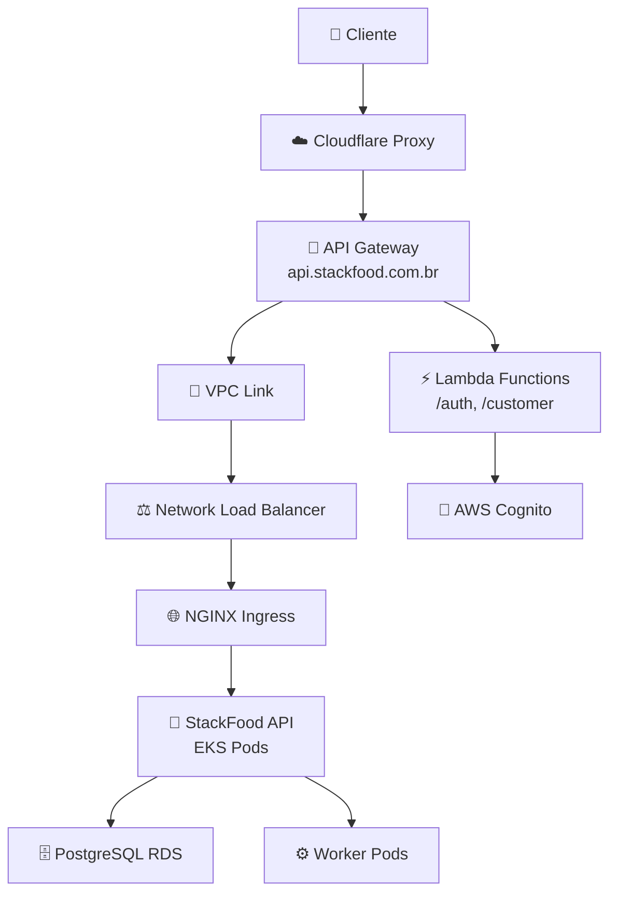

# StackFood - Infraestrutura Completa Teste

> 🍽️ **Plataforma de gestão para food service com arquitetura moderna em nuvem**

[](https://aws.amazon.com/)
[](https://kubernetes.io/)
[](https://terraform.io/)
[](https://aws.amazon.com/api-gateway/)

## 📑 Índice

- [🚀 Sobre o Projeto](#-sobre-o-projeto)
- [🏗️ Arquitetura da Solução](#%EF%B8%8F-arquitetura-da-solução)
- [📂 Estrutura do Projeto](#-estrutura-do-projeto)
- [☁️ Infraestrutura AWS (Terraform)](#%EF%B8%8F-infraestrutura-aws-terraform)
- [🐳 Kubernetes & GitOps](#-kubernetes--gitops)
- [🚀 Guia de Implantação](#-guia-de-implantação)
- [💻 Desenvolvimento Local](#-desenvolvimento-local)
- [🔧 Solução de Problemas](#-solução-de-problemas)
- [📚 Referências](#-referências)

## 🚀 Sobre o Projeto

**StackFood** é uma plataforma completa de gestão para food service que permite o gerenciamento integrado de:

- 👥 **Clientes e Autenticação** (via Lambda + Cognito)
- 🍕 **Catálogo de Produtos** (via API principal)
- 📦 **Pedidos e Pagamentos** (via API principal)
- ⚡ **Processamento Assíncrono** (via Workers)

### 🎯 Características Principais

- **Arquitetura Híbrida**: Combina serverless (Lambda) com containers (EKS)
- **API Gateway como Proxy**: Roteamento inteligente entre Lambda e EKS
- **GitOps**: Infraestrutura como código com Terraform + Kubernetes
- **Multi-ambiente**: Desenvolvimento e produção completamente isolados
- **Segurança**: ACM + Cloudflare + VPC Link para comunicação segura

## 🏗️ Arquitetura da Solução

### 🌐 Fluxo de Tráfego Completo



### 📋 Componentes da Arquitetura

| Componente         | Tecnologia              | Função                                   |
| ------------------ | ----------------------- | ---------------------------------------- |
| **Frontend Proxy** | Cloudflare              | CDN, DDoS Protection, Edge SSL           |
| **API Gateway**    | AWS API Gateway         | Roteamento, Rate Limiting, Monitoramento |
| **Autenticação**   | AWS Lambda + Cognito    | Gestão de usuários e tokens              |
| **API Principal**  | EKS + .NET              | Business logic, CRUD operations          |
| **Banco de Dados** | Amazon RDS (PostgreSQL) | Persistência de dados                    |
| **Processamento**  | Kubernetes Jobs         | Tarefas assíncronas                      |
| **Networking**     | VPC + VPC Link          | Comunicação segura                       |
| **Certificados**   | ACM + Cloudflare        | SSL/TLS end-to-end                       |

### 🔄 Roteamento de Requisições

| Endpoint         | Destino    | Descrição             |
| ---------------- | ---------- | --------------------- |
| `GET /auth/*`    | 🔐 Lambda  | Autenticação e tokens |
| `POST /customer` | 🔐 Lambda  | Criação de clientes   |
| `GET /swagger`   | 🐳 EKS API | Documentação da API   |
| `/*`             | 🐳 EKS API | Todas as outras rotas |

## 📂 Estrutura do Projeto

```
stackfood-infra/
├── terraform/              # 🏗️ Infraestrutura como Código
│   └── aws/
│       ├── env/               # 📋 Configurações por ambiente
│       │   └── prod.tfvars    # 🔧 Variáveis de produção
│       ├── main/              # 🎯 Configuração principal
│       │   ├── main.tf        # 🏗️ Módulos e recursos
│       │   ├── variables.tf   # 📝 Definição de variáveis
│       │   └── providers.tf   # ⚙️ Providers (AWS, Cloudflare)
│       └── modules/           # 🧩 Módulos reutilizáveis
│           ├── vpc/           # 🌐 Rede virtual
│           ├── eks/           # ☸️ Cluster Kubernetes
│           ├── rds/           # 🗄️ Banco de dados
│           ├── lambda/        # ⚡ Funções serverless
│           ├── api-gateway/   # 🚪 Gateway de API
│           ├── acm/           # 🔒 Certificados SSL
│           └── cognito/       # 🔐 Autenticação
├── apps/                   # 🐳 Aplicações Kubernetes
│   ├── api/                   # 🎯 API principal
│   │   ├── base/              # 📋 Configuração base
│   │   └── prod/              # 🏭 Configuração de produção
│   ├── worker/                # ⚙️ Processamento assíncrono
│   └── namespaces/            # 📦 Namespaces
├── .github/workflows/      # 🔄 CI/CD Pipelines
└── scripts/                # 🛠️ Scripts de automação
```

## ☁️ Infraestrutura AWS (Terraform)

### 🎯 Recursos Provisionados

- **VPC** com subnets públicas/privadas em múltiplas AZs
- **Security Groups** com regras específicas por serviço
- **VPC Link** para comunicação API Gateway ↔ EKS
- **EKS Cluster** (v1.33) com node groups auto-scaling
- **RDS PostgreSQL** (16.3) com backup e monitoring
- **Application Load Balancer** integrado ao EKS
- **Auto Scaling Groups** para alta disponibilidade
- **API Gateway** (Regional) com custom domain
- **Lambda Functions** para autenticação
- **AWS Cognito** para gestão de usuários
- **ACM Certificates** para SSL/TLS
- **Cloudflare DNS** integration
- **IAM Roles** com permissões mínimas
- **EBS Volumes** para persistência dos pods
- **NGINX Ingress Controller** no EKS

### 💰 **Otimização de Custos**

- ✅ **EKS Nodes**: t3.large com auto-scaling
- ✅ **RDS**: db.t3.micro com 20GB storage
- ✅ **Lambda**: Pay-per-use para autenticação
- ✅ **API Gateway**: Regional (mais barato que Edge)

## 🐳 Kubernetes & GitOps

### 📦 **Aplicações**

#### 🎯 **StackFood API**

```yaml
# Deployment principal com:
replicas: 2
resources:
  requests: { cpu: 100m, memory: 256Mi }
  limits: { cpu: 500m, memory: 512Mi }
ports: [5039, 7189] # HTTP + HTTPS
probes: livenessProbe + readinessProbe
```

#### ⚙️ **Worker**

```yaml
# Processamento assíncrono
replicas: 1
resources: { cpu: 100m, memory: 256Mi }
```

### 🔧 **Configuração com Kustomize**

```yaml
# apps/api/base/kustomization.yaml
apiVersion: kustomize.config.k8s.io/v1beta1
kind: Kustomization
resources:
  - deployment.yaml
  - service.yaml
  - ingress.yaml
  - hpa.yaml
```

### 🌐 **Ingress & Load Balancing**

```yaml
# NGINX Ingress configurado para:
annotations:
  nginx.ingress.kubernetes.io/backend-protocol: "HTTPS"
  nginx.ingress.kubernetes.io/ssl-redirect: "false"
  nginx.ingress.kubernetes.io/use-forwarded-headers: "true"
```

## 🚀 Guia de Implantação

### 🔧 **Pré-requisitos**

```bash
terraform >= 1.0.0
aws-cli >= 2.0
kubectl >= 1.25
git >= 2.30
```

### ☁️ **1. Provisionar Infraestrutura AWS**

```bash
git clone https://github.com/Stack-Food/stackfood-infra.git
cd stackfood-infra
aws configure
cd terraform/aws/main
terraform init
terraform plan -var-file="../env/prod.tfvars"
terraform apply -var-file="../env/prod.tfvars"
```

### 📋 **2. Configurar Variáveis**

Edite `terraform/aws/env/prod.tfvars`:

```hcl
domain_name = "stackfood.com.br"
cloudflare_zone_id = "sua-zone-id"
eks_cluster_name = "stackfood-eks"
kubernetes_version = "1.33"
```

### ☸️ **3. Implantar Aplicações**

```bash
aws eks update-kubeconfig --region us-east-1 --name stackfood-eks
kubectl apply -k apps/api/prod/
kubectl get pods -n stackfood
kubectl get ingress -n stackfood
```

## 🔧 Solução de Problemas

### ❌ **Problemas Comuns**

#### 🔐 **Erro de Autenticação AWS**

```bash
aws configure
export AWS_ACCESS_KEY_ID="sua-key"
export AWS_SECRET_ACCESS_KEY="sua-secret"
aws sts get-caller-identity
```

#### 🌐 **API Gateway não acessa EKS**

```bash
aws apigateway get-vpc-links
aws ec2 describe-security-groups --group-names "*api-gateway*"
kubectl get svc -n ingress-nginx
```

#### 📦 **Pods não sobem**

```bash
kubectl describe pod <pod-name> -n stackfood
kubectl get secrets -n stackfood
kubectl get configmaps -n stackfood
```

#### 🗄️ **Banco de dados não conecta**

```bash
aws rds describe-db-instances --db-instance-identifier stackfood-postgres
aws ec2 describe-security-groups --filters "Name=group-name,Values=*rds*"
kubectl run pg-test --image=postgres:16 -it --rm -- psql -h <rds-endpoint> -U stackfood
```

## 📚 Referências

- [🏗️ Terraform AWS Provider](https://registry.terraform.io/providers/hashicorp/aws/latest/docs)
- [☸️ Kubernetes Documentation](https://kubernetes.io/docs/)
- [🚪 AWS API Gateway](https://docs.aws.amazon.com/apigateway/)
- [⚡ AWS Lambda](https://docs.aws.amazon.com/lambda/)
- [🔐 AWS Cognito](https://docs.aws.amazon.com/cognito/)
- [📋 Kustomize](https://kustomize.io/)
- [🌐 NGINX Ingress Controller](https://kubernetes.github.io/ingress-nginx/)
- [☁️ Cloudflare](https://developers.cloudflare.com/)
- [🔄 GitOps Principles](https://www.gitops.tech/)
- [☸️ Kubernetes Best Practices](https://kubernetes.io/docs/concepts/configuration/overview/)
- [🔒 AWS Security Best Practices](https://aws.amazon.com/architecture/security-identity-compliance/)

---
