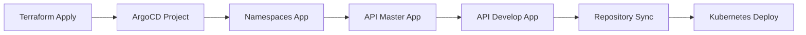

# 🚀 ArgoCD Applications Module - StackFood

Este módulo Terraform configura automaticamente as aplicações ArgoCD para o projeto StackFood usando manifestos YAML templatizados.

## 📁 Estrutura do Módulo

```
argocd-applications/
├── main.tf                          # Recursos Terraform
├── variables.tf                     # Variáveis de entrada
├── outputs.tf                       # Outputs do módulo
├── README.md                        # Este arquivo
└── configs/                         # Manifestos YAML templatizados
    ├── projects/
    │   └── stackfood-project.yaml   # Projeto ArgoCD
    └── applications/
        ├── stackfood-namespaces.yaml     # Gerenciamento de namespaces
        ├── stackfood-api-master.yaml     # API - Production (master)
        └── stackfood-api-develop.yaml    # API - Development (develop)
```

## 🎯 Funcionalidades

- ✅ **Projeto ArgoCD** com RBAC e controle de repositórios
- ✅ **Gerenciamento de Namespaces** automático
- ✅ **API Production** sincronizada com branch `master`
- ✅ **API Development** (opcional) sincronizada com branch `develop`
- ✅ **Templates YAML** parametrizados com Terraform
- ✅ **Dependências automáticas** entre recursos

## 🔧 Configuração

### Uso Básico (Apenas Production)

```hcl
module "argocd_applications" {
  source = "../modules/kubernetes/argocd-applications"

  # Configurações básicas
  source_repo_url = "https://github.com/Stack-Food/stackfood-api.git"
  target_revision = "master"
  api_namespace   = "stackfood"

  # Sync conservador para produção
  enable_auto_sync = false
}
```

### Uso com Development

```hcl
module "argocd_applications" {
  source = "../modules/kubernetes/argocd-applications"

  source_repo_url             = "https://github.com/Stack-Food/stackfood-api.git"
  target_revision             = "master"
  api_namespace               = "stackfood"
  enable_develop_environment  = true    # Habilita ambiente de desenvolvimento
}
```

## 📋 Variáveis

| Nome                         | Descrição                | Tipo     | Padrão                                              |
| ---------------------------- | ------------------------ | -------- | --------------------------------------------------- |
| `namespace`                  | Namespace do ArgoCD      | `string` | `"argocd"`                                          |
| `project_name`               | Nome do projeto ArgoCD   | `string` | `"stackfood"`                                       |
| `source_repo_url`            | URL do repositório fonte | `string` | `"https://github.com/Stack-Food/stackfood-api.git"` |
| `target_revision`            | Branch de produção       | `string` | `"master"`                                          |
| `api_namespace`              | Namespace da API         | `string` | `"stackfood"`                                       |
| `enable_auto_sync`           | Sync automático          | `bool`   | `false`                                             |
| `enable_develop_environment` | Habilitar ambiente dev   | `bool`   | `false`                                             |

## 📤 Outputs

| Nome                    | Descrição                   |
| ----------------------- | --------------------------- |
| `project_name`          | Nome do projeto criado      |
| `applications`          | Mapa das aplicações criadas |
| `configuration_summary` | Resumo da configuração      |

## 🏗️ Aplicações Criadas

### 1. stackfood-namespaces

- **Função**: Gerencia namespaces Kubernetes
- **Repository**: stackfood-api
- **Branch**: master
- **Path**: `manifests/namespaces`
- **Sync**: Automático

### 2. stackfood-api-master

- **Função**: API de produção
- **Repository**: stackfood-api
- **Branch**: master
- **Path**: `manifests/api/prod`
- **Sync**: Manual (configurável)

### 3. stackfood-api-develop (opcional)

- **Função**: API de desenvolvimento
- **Repository**: stackfood-api
- **Branch**: develop
- **Path**: `manifests/api/dev`
- **Sync**: Automático

## 📂 Estrutura Esperada no Repositório

O módulo espera a seguinte estrutura no repositório `stackfood-api`:

```
stackfood-api/
├── manifests/
│   ├── namespaces/
│   │   └── namespace.yaml           # Define namespace stackfood
│   └── api/
│       ├── base/                    # Kustomize base
│       │   ├── kustomization.yaml
│       │   ├── deployment.yaml
│       │   ├── service.yaml
│       │   └── ingress.yaml
│       ├── dev/                     # Development overlay
│       │   ├── kustomization.yaml
│       │   ├── configmap.yaml
│       │   └── patch-deployment.yaml
│       └── prod/                    # Production overlay
│           ├── kustomization.yaml
│           ├── configmap.yaml
│           └── patch-deployment.yaml
└── src/                             # Código da aplicação
```

## 🚀 Deploy

### 1. Aplicar o Módulo

```bash
cd terraform/aws/main
terraform plan -var-file="../env/prod.tfvars"
terraform apply -var-file="../env/prod.tfvars"
```

### 2. Verificar Criação

```bash
# Verificar projeto
kubectl get appproject stackfood -n argocd

# Verificar aplicações
kubectl get applications -n argocd

# Status detalhado
kubectl describe application stackfood-api-master -n argocd
```

### 3. Sync Manual (Production)

```bash
# Via ArgoCD CLI
argocd app sync stackfood-api-master

# Via kubectl
kubectl patch application stackfood-api-master -n argocd \
  --type merge -p '{"operation":{"sync":{"revision":"HEAD"}}}'
```

## 🔄 Fluxo GitOps



## ⚙️ Políticas de Sync

### Production (Master)

- **Sync**: Manual
- **Self-Heal**: Habilitado
- **Prune**: Desabilitado (segurança)
- **Retry**: 5 tentativas

### Development (Develop)

- **Sync**: Automático
- **Self-Heal**: Habilitado
- **Prune**: Habilitado
- **Retry**: 3 tentativas

## 🔍 Troubleshooting

### Verificar Status

```bash
# Status do projeto
kubectl get appproject stackfood -n argocd -o yaml

# Status das aplicações
kubectl get applications -n argocd

# Logs do ArgoCD
kubectl logs -n argocd deployment/argocd-application-controller
```

### Forçar Refresh

```bash
# Hard refresh
kubectl annotate application stackfood-api-master -n argocd \
  argocd.argoproj.io/refresh=hard
```

## 🔐 Requisitos

- **ArgoCD** instalado no cluster
- **kubectl provider** configurado no Terraform
- **Repositório stackfood-api** acessível
- **Permissões** adequadas no cluster

## 🎯 Vantagens

- **Infraestrutura como Código**: Configuração versionada
- **Templates Reutilizáveis**: YAMLs parametrizados
- **Dependências Automáticas**: Ordem de criação controlada
- **Estado Gerenciado**: Terraform state management
- **Rollback Automático**: Em caso de falhas
- **Configuração Unificada**: Junto com a infraestrutura

---

**📝 Nota**: Este módulo simplifica drasticamente a configuração do ArgoCD, permitindo que toda a infraestrutura GitOps seja gerenciada via Terraform!
